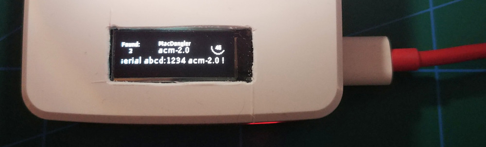

# MacDongler
A USB host scanner based on Linux USB Gadgets, designed to circumvent USB device blocklists.

MacDongler cycles through a list of known USB device configurations, Vendor IDs and Product IDs. It then emulates each device to see if the plugged in USB host allows or interacts with the device.

This is useful to, for example, identify specific brands or models of USB dongles allowed by a locked-down device.


## Prerequisites

These things need to be set up in the system before MacDongler will run properly. Wherever possible, the script performs these sanity checks automatically.

 1. Make sure your kernel is configured with the following options
    - `CONFIG_CONFIGFS_FS`
    - `CONFIG_USB_GADGET`
    - `CONFIG_USB_DUMMY_HCD`
    - `CONFIG_USB_CONFIGFS`
    - `CONFIG_USB_LIBCOMPOSITE`

 2. Make sure at least one `udc` kernel module is compiled in or loaded, i.e.
    your desired USB Device Controller is visible under `/sys/class/udc`
    ```
    # modprobe dummy_hcd
    # ls -l /sys/class/udc
    dummy_udc.0
    ```

 3. Mount the `configfs` under `/sys/kernel/config` if it isn't already:
    ```
    # mount -t configfs none /sys/kernel/config
    # ls /sys/kernel/config
    ```

 4. Make sure the `libcomposite` kernel module is loaded


### Raspbian hints

The above steps are general instructions for a typical linux install (tested on Kali linux with the `dummy_hcd` driver). If you're using a Rasbpberry Pi (from the 4 or Zero families) with raspbian OS, the following instructions may be helpful:

 1. Raspbian does not provide the `dummy_hcd` module, but is only needed if you want to do software-only tests.

 2. Add the line `dtoverlay=dwc2` to your `/boot/config.txt` and reboot to get the hardware UDC controller running.
  This should give you something under `/sys/class/udc`. It may have a different name, that's fine.
  ```
  # ls /sys/class/udc
  fe980000.usb
  ```


## Usage

### What the program does
When invoked with `--test-multiple-devices`, MacDongler performs the following actions, in order:

  - For each device name provided on the command line
    1. Set up an emulated version of that device
    2. Delay for `--setup-duration` seconds
    3. Provide stimulation to the host, for example from `--net-transmit-pcap` or `--serial-transmit-file`
    4. Delay for `--test-duration` seconds
    5. Apply a set of heuristic tests to see if the device appears to be active, i.e. if the host accepts this device
    6. If the heuristics indicate success, save the device specification to the `--output` file
    7. Tear down the emulated device

At the end of a cycle like this, the `--output` file contains a set of device specs which, as far as we can tell, are
accepted by the connected USB host.

### Results

The `--output` file follows the exact same format as the device database, and can be used as such. If a device is tested and heuristics indicate that the device is accepted by the host, a complete device specification is appended to the output file. You can then inspect the properties (e.g VID and PID of the device) or use `--create-device` to set up persistent emulation withe the same parameters

```
    # Run the scan against our host
  $ ./MacDongler --output /tmp/network.json5 --test-multiple net
    ...
    FOUND: Device acm-2.0 appears to work!
    ...

    # Take a look at what was found
  $ ./MacDongler --device-db /tmp/network.json5 --list-devices
    ...
    acm-2.0
    ...

    # Emulate one of the successful devices
  $ ./MacDongler --device-db /tmp/network.json5 --create-device acm-2.0
    ...
    INFO: Created device acm-2.0 at /dev/ttyGS0

```

### Frontends

Since scanning takes a while, and typically only embedded devices have access to a USB Device Controller, the `--status-file` is machine-parsable to allow for more user-friendly front-ends.

#### pioled
If you are running MacDongler on a rasberry pi equipped with an [Adafruit PiOLED](https://www.adafruit.com/product/3527), the script `frontends/macdongler-pioled.py` visualizes the current progress:



The display shows current progress, the number of successful devices found, the name of the current device under test, and the bottom line contains the latest warning, error or found device.

### Stability hacks
Given the risk of driver failure, since this script is basically fuzzing your USB stack, a number of features exist to help make the process more robust.

#### Resuming
By providing `--resume`, you can pick up where the last execution left off. This will start from the next un-tested USB device. This allows you to reboot your dongle machine, if needed.

#### Single-step
Run with the `--single-step` (`-1`) to terminate after testing a single device. On particularly troublesome hardware, this allows you to easily script a rebooting loop by putting something like this in your autostart:

```
MacDongler --resume --single-step --scan-devices 'ecm.*' 'rndis.*'
[ $_ -eq 10 ] && reboot
```

This way, the system will boot, a single new device will be tested (`--resume` ensures that progress is saved), and then the system will reboot again. This will continue until all devices have been tested.

A script is provided to do this, in `support/dongle_and_reboot.sh`.

Alternatively, you could do something similar but reload the device controller driver between attempts. This should be faster than rebooting, but solve fewer problems.

#### Delaying
If you're seeing unpredictable or unstable results, try increasing `--setup-duration` to allow new devices to settle.

If you're not seeing the detection you would expect (especially from the `net.rx` and `serial.rx` heuristics), try increasing `--test-duration`. This will extend the time period before a tested device is dismissed.


## Device database
Supported devices are specified in JSON5 files, in a simple hierarchical directory structure. Each device specification has a name, which is how it is referred to on the command line.

Each device specification can designate a single "template", which is another device name. The new device will be based on the template device, only overriding the settings present in the new specification.

The template can be the name of any device defined __in a parent directory__ of the current device specification. The following example illustrates the template support:

```
File structure:
devices/net/rndis_template.json5
devices/net/rndis_devices/abcd.json5
devices/msc/msc_template.json5


rndis_template.json5:
[
   { "name": "rndis",
     "feature": "value",
     "identifier": "TMPL",
   },
]


abcd.json5:
[
  { "name": "abcd",
    "template": "rndis",
    "identifier": "ABCD",
  },

  { "name": "qwer",
    "template": "rndis",
    "feature": "another_value",
  }
]

```


The two devices `abcd` and `qwer` will inherit all properties from the `rndis` device. `abcd` will override the `identifier` field, and get `feature` from the template.

These devices **cannot** specify anything from `msc_template` as their template, since that file isn't in a parent directory.

To get an idea for the exact values expected from a device specification, take a look at `--list-devices` with exactly one device:

```
MacDongler --list-devices linksys-usb3gigv1
```

### Device generator

A script is provided under `support/generate_devices.sh` to auto-generate large numbers of VID/PID combinations using an existing device template. This allows you to, for example,
write a template for a specific mass storage device, and then generate new devices with known VID/PID which inherit the configuration of that template.


## TODO
 - Web frontend
    - Serve from the same device, but run the logic in the browser to survive slow boot loops.
 - Sanity check device database.
    - Are you using functions that aren't defined?
    - Do you have a valid device type?
    - Are the function types as expected (soft error)
    - Does the non-template device have all expected metadata?
 - More device types
    - Storage
    - Joystick
    - Mouse
    - Audio?
    - Video?
 - One-shot mode
    - test-multiple, but stop at the first successful device and leave it up
    - immediately bridge the network to eth0 or expose the serial port or whatever
      - This may be out of scope. Maybe just a zero return code for "Yes, a device was set up" and a parsable entry in the status file.
    - plug in, auto-hack, success!
 - More heuristics
    - serial: got configured?
    - storage: was the FAT read?
    - storage: was anything updated (last mount time?!)
    - storage: transferred bytes?
    - hid: Hit caps lock and num lock, see if the LEDs change?
    - generic: number of USB commands received...?
